# Pinn-Ocean: Coupling Shifted Window Self-Attention with Physics-Informed Continuous Depth Representation for 3-D Ocean Thermohaline Reconstruction

[](LICENSE)
[](https://www.python.org/)
[](https://pytorch.org/)
[]()
[]()

[English](README.md) | [中文说明文档](README.zh.md)

---

## 1. Overview

Reconstructing three-dimensional (3-D) ocean temperature and salinity (thermohaline) fields from two-dimensional (2-D) satellite surface observations is critical for climate prediction (e.g., AMOC, ENSO), ocean acoustic propagation, and maritime security. While satellite altimetry and radiometry provide high-frequency, basin-wide sea surface measurements (such as Sea Level Anomaly [SLA] and Sea Surface Temperature [SST]), direct subsurface observation networks (e.g., Argo profiling floats) remain sparse and intermittent.

Traditional deep learning approaches rely on purely data-driven black-box architectures (e.g., 2-D CNNs), which often suffer from limited receptive fields, non-physical predictions (such as density inversions and abnormal thermal inversions), and finite difference truncation errors across discrete layers.

Pinn-Ocean addresses these challenges by coupling a Swin Transformer spatial backbone with a Physics-Informed Neural Network (PINN) continuous coordinate decoder. By integrating the TEOS-10 equation of state directly into the loss function via PyTorch autograd, Pinn-Ocean reconstructs continuous 3-D thermohaline fields constrained by hydrostatic and thermodynamic principles.

---

## 2. Training Data Sources

The dataset is sourced from the Copernicus Marine Service (CMEMS) and the International Argo Program.

### 2.1 Study Area and Time Horizon
- Spatial range: Northwest Pacific (145°E–165°E, 30°N–40°N), depth 0–1000m. Open ocean without land cover.
- Time range: January 2013 to December 2021 (monthly mean, 108 months).
  - Training set: 2013–2018 (72 months)
  - Validation set: 2019–2020 (24 months)
  - Test set: 2021 (12 months)

### 2.2 Dataset Inventory

| Variable | Dataset / Source | Resolution | Depth | Purpose |
| :--- | :--- | :--- | :--- | :--- |
| SLA (Sea Level Anomaly) | cmems_obs-sl_glo_phy-ssh_my_allsat-l4-duacs-0.125deg_P1M-m | 0.125° | Surface | Input feature |
| SST (Sea Surface Temperature) | METOFFICE-GLO-SST-L4-REP-OBS-SST (OSTIA) | 0.05° | Surface | Input feature |
| SSS (Sea Surface Salinity) | cmems_obs-mob_glo_phy-sal_my_multi-oi_P7D-c | 0.25° | Surface | Input feature |
| Wind U/V (Scatterometer Wind) | cmems_obs-wind_glo_phy_my_l4_P1M | 0.25° | Surface | Input feature |
| Lon / Lat / Month | Coordinate grids & cyclic month encoding | Grid-aligned | Surface | Input feature |
| Potential temp & salinity (thetao, so) | cmems_mod_glo_phy_my_0.083deg_P1M-m (GLORYS12V1) | 1/12° (~0.083°) | 0–1000m (25 levels) | Training target |
| In-situ T/S profiles | International Argo Program / China Argo Centre | Profiles | 0–1000m | Independent test |

---

## 3. Key Architecture & Methodology

```mermaid
%%{init: {
  'theme': 'base',
  'themeVariables': {
    'background': '#FFFFFF',
    'primaryColor': '#FFFFFF',
    'primaryBorderColor': '#CBD5E1',
    'primaryTextColor': '#0F172A',
    'secondaryColor': '#F8FAFC',
    'tertiaryColor': '#FFFFFF',
    'mainBkg': '#FFFFFF',
    'clusterBkg': '#FFFFFF',
    'clusterBorder': '#E2E8F0',
    'lineColor': '#475569',
    'textColor': '#0F172A',
    'edgeLabelBackground': '#FFFFFF',
    'fontFamily': 'system-ui, -apple-system, BlinkMacSystemFont, "Segoe UI", Roboto, sans-serif'
  }
}}%%
flowchart TD
    subgraph S1 [" "]
        direction TB
        H1["1. Surface Multi-Forcing Inputs<br/>(8 Channels)"]
        I1["Dynamic Tracers: SST / SLA / SSS"]
        I2["Boundary Forcing: Wind Stress (Wind U / V)"]
        I3["Spatiotemporal: Lon, Lat / Month Period"]
        H1 --> I1 --- I2 --- I3
    end

    subgraph S2 [" "]
        direction TB
        H2["2. Spatial Attention Backbone<br/>(Swin Transformer)"]
        E1["Patch Embedding: Hidden Dimension C"]
        E2["W-MSA / SW-MSA<br/>Local and Shifted Window Attention"]
        E3["Surface Latent Feature Token Matrix F_surf"]
        H2 --> E1 ==> E2 ==> E3
    end

    subgraph S3 [" "]
        direction TB
        H3["3. Continuous PINN Decoder<br/>(Implicit Neural Representation)"]
        D1["Vertical Depth Variable<br/>z ∈ [0, 1000m] (requires_grad)"]
        D2["Latent Concatenation: [F_surf, z] Representation"]
        D3["Continuous MLP Decoder: Smooth Tanh Activation"]
        H3 --> D1 --> D2 ==> D3
    end

    subgraph S4 [" "]
        direction TB
        H4["4. 3-D Thermohaline Field Prediction<br/>(0–1000m)"]
        O1["Reconstructed Temperature T_hat<br/>(Mixed Layer / Thermocline)"]
        O2["Reconstructed Salinity S_hat<br/>(Subsurface Halocline)"]
        H4 --> O1 --- O2
    end

    subgraph S5 [" "]
        direction TB
        H5["5. Physics Priors & Adaptive Balancing<br/>(Closed Loop)"]
        P1["Data Loss L_data: GLORYS12V1 Full-Depth MSE"]
        P2["Thermal Monotonicity L_phy,T<br/>Autograd dT/dz ≤ 0"]
        P3["Stratification Stability L_phy,rho<br/>TEOS-10 drho/dz ≥ 0"]
        Opt["Adaptive Multi-Objective Balancing<br/>& Backpropagation"]
        H5 --> P1 --- P2 --- P3 ==> Opt
    end

    I3 ==>|Surface Tensor X_surf| H2
    E3 ==>|Latent Tokens F_surf| H3
    D3 ==>|Continuous Depth Decoding| H4
    O2 ==>|3-D Physical Validation| H5
    Opt -. Closed-Loop Physical Gradient .-> H2

    style S1 fill:#FFFFFF,stroke:#0284C7,stroke-width:1.5px,stroke-dasharray: 4 4,rx:8px,ry:8px
    style S2 fill:#FFFFFF,stroke:#7C3AED,stroke-width:1.5px,stroke-dasharray: 4 4,rx:8px,ry:8px
    style S3 fill:#FFFFFF,stroke:#059669,stroke-width:1.5px,stroke-dasharray: 4 4,rx:8px,ry:8px
    style S4 fill:#FFFFFF,stroke:#D97706,stroke-width:1.5px,stroke-dasharray: 4 4,rx:8px,ry:8px
    style S5 fill:#FFFFFF,stroke:#E11D48,stroke-width:1.5px,stroke-dasharray: 4 4,rx:8px,ry:8px

    classDef headStyle1 fill:#0284C7,stroke:#0284C7,stroke-width:1.5px,color:#FFFFFF,rx:6px,ry:6px;
    classDef headStyle2 fill:#7C3AED,stroke:#7C3AED,stroke-width:1.5px,color:#FFFFFF,rx:6px,ry:6px;
    classDef headStyle3 fill:#059669,stroke:#059669,stroke-width:1.5px,color:#FFFFFF,rx:6px,ry:6px;
    classDef headStyle4 fill:#D97706,stroke:#D97706,stroke-width:1.5px,color:#FFFFFF,rx:6px,ry:6px;
    classDef headStyle5 fill:#E11D48,stroke:#E11D48,stroke-width:1.5px,color:#FFFFFF,rx:6px,ry:6px;

    classDef inputStyle fill:#F0F9FF,stroke:#0284C7,stroke-width:1.5px,color:#0369A1,rx:6px,ry:6px;
    classDef encStyle fill:#F5F3FF,stroke:#7C3AED,stroke-width:1.5px,color:#5B21B6,rx:6px,ry:6px;
    classDef pinnStyle fill:#ECFDF5,stroke:#059669,stroke-width:1.5px,color:#047857,rx:6px,ry:6px;
    classDef outStyle fill:#FFFBEB,stroke:#D97706,stroke-width:1.5px,color:#B45309,rx:6px,ry:6px;
    classDef phyStyle fill:#FFF1F2,stroke:#E11D48,stroke-width:1.5px,color:#BE123C,rx:6px,ry:6px;

    class H1 headStyle1;
    class H2 headStyle2;
    class H3 headStyle3;
    class H4 headStyle4;
    class H5 headStyle5;

    class I1,I2,I3 inputStyle;
    class E1,E2,E3 encStyle;
    class D1,D2,D3 pinnStyle;
    class O1,O2 outStyle;
    class P1,P2,P3,Opt phyStyle;
```

<div align="center">



</div>

### 3.1 Core Forward Mapping Formulation & Neural Operator Fusion

The network models the 3-D ocean reconstruction as a neural operator problem fusing 2-D sea surface dynamics with continuous vertical depth $z \in [0, 1000\,\mathrm{m}]$:

$$
[\hat{T}, \hat{S}] = \mathcal{G}_\theta\left(\mathbf{X}_{\mathrm{surf}}, \boldsymbol{\gamma}(z)\right)
$$

where $`\mathbf{X}_{\mathrm{surf}} \in \mathbb{R}^{B \times 8 \times H \times W}`$ encodes the 8 surface channels with cyclic seasonal thermal phase $`\tau_{\mathrm{season}} = -\cos\left(2\pi \frac{\text{month} - 2}{12}\right)`$, and $`\boldsymbol{\gamma}(z)`$ represents the **`DepthFourierEmbedding`** multi-scale harmonic coordinate embedding ($`z_{\mathrm{lin}}`$, $`z_{\mathrm{log}}`$, $`\sin(2^k\pi z)`$, $`\cos(2^k\pi z)`$ across 8 octaves) to overcome coordinate spectral bias.

The latent representation is fused via a **DeepONet Trunk-Branch Operator Fusion** module with multiplicative and residual connections:

$$
\mathbf{F}_{\mathrm{fused}} = \mathrm{SiLU}\left(\mathbf{F}_{\mathrm{branch}} \odot \mathbf{F}_{\mathrm{trunk}} + \mathbf{F}_{\mathrm{branch}} + \mathbf{F}_{\mathrm{trunk}}\right)
$$

followed by **decoupled dual prediction heads**: a dedicated temperature head and an expanded 3-layer MLP salinity head capable of reconstructing non-monotonic S-shaped haloclines.

### 3.2 Shifted Window Self-Attention (Swin Transformer)

Spatial teleconnections are modeled via alternating local window multi-head self-attention (W-MSA) and shifted window self-attention (SW-MSA):

$$
\text{Attention}(Q, K, V) = \text{Softmax}\left(\frac{QK^T}{\sqrt{d}} + B\right) V
$$

where $B$ is the learnable relative position bias matrix.

### 3.3 Active Ocean Physics Loss Engine

**1. Dynamic Height Anomaly (SLA) Coupling** ($\mathcal{L}_{\mathrm{sla}}$):
Using TEOS-10 in-situ density integration to match radar altimetry SLA:

$$
\Delta h_{\mathrm{steric}}(x, y) = -\frac{1}{\rho_0} \int_{0}^{H} \rho'(x, y, z) \, \mathrm{d}z, \quad \mathcal{L}_{\mathrm{sla}} = \mathrm{MSE}\left(\Delta h_{\mathrm{steric}}, \mathrm{SLA}_{\mathrm{obs}}\right)
$$

**2. Unified Sea Surface Dirichlet Boundary Anchor** ($\mathcal{L}_{\mathrm{surf}}$):
Anchors $z = 0.5\,\mathrm{m}$ predictions to satellite SST and SSS in the unified 3D target normalization frame:

$$
\mathcal{L}_{\mathrm{surf}} = \left\| \hat{T}_{\mathrm{norm}}(z_0) - \mathrm{SST}_{\mathrm{norm}} \right\|^2 + \left\| \hat{S}_{\mathrm{norm}}(z_0) - \mathrm{SSS}_{\mathrm{norm}} \right\|^2
$$

**3. Continuous Profile Derivative Supervision** ($\mathcal{L}_{\mathrm{grad}}$):
First-order finite difference gradient matching per 100m water depth:

$$
\mathcal{L}_{\mathrm{grad}} = \left\| \frac{\partial \hat{T}}{\partial z_{100}} - \frac{\partial T_{\mathrm{gt}}}{\partial z_{100}} \right\|^2 + 2 \cdot \left\| \frac{\partial \hat{S}}{\partial z_{100}} - \frac{\partial S_{\mathrm{gt}}}{\partial z_{100}} \right\|^2
$$

**4. Mixed Layer Isothermal Regularization** ($\mathcal{L}_{\mathrm{mld}}$):
Penalizes unphysical near-surface temperature curvature exceeding $0.02^\circ\mathrm{C}/\mathrm{m}$ in the upper 30m:

$$
\mathcal{L}_{\mathrm{mld}} = \frac{1}{N_{\mathrm{mld}}} \sum_{z_k \le 30\,\mathrm{m}} \mathrm{ReLU}\left( \left| \frac{\partial \hat{T}_{\mathrm{phys}}}{\partial z} \right| - 0.02^\circ\mathrm{C}/\mathrm{m} \right)
$$

**5. Smooth Stratification Stability (Anti-Density-Inversion)** ($\mathcal{L}_{\mathrm{stab}}$):
Continuous softplus penalty enforcing non-negative vertical density gradients:

$$
\mathcal{L}_{\mathrm{stab}} = \frac{1}{N} \sum_{i=1}^N \mathrm{Softplus}\left(- 10 \cdot \frac{\partial \hat{\rho}_i}{\partial z}\right)
$$

**6. Adaptive Multi-Objective Balancing** ($\mathcal{L}_{\mathrm{total}}$):

$$
\mathcal{L}_{\mathrm{total}} = \exp(-\omega_1) \mathcal{L}_{\mathrm{data}} + \omega_1 + \exp(-\omega_2) \mathcal{L}_{\mathrm{phy}} + \omega_2
$$

where $\omega_1, \omega_2$ are learnable homoscedastic log-variance dual parameters dynamically adjusted during optimization.

---

## 4. Repository Structure

```text
Pinn-Ocean/
├── configs/
│   ├── __init__.py
│   └── default_config.py      # Experiment, model, and physical loss hyperparameters
├── pinn_ocean/                # Core Python Package
│   ├── __init__.py
│   ├── models/                # Deep learning architectures
│   │   ├── __init__.py
│   │   ├── swin_blocks.py     # Swin Transformer basic building blocks (W-MSA/SW-MSA)
│   │   └── swin_ocean_pinn.py # Swin-Ocean-PINN complete end-to-end model
│   ├── losses/                # Physics & adaptive optimization losses
│   │   ├── __init__.py
│   │   ├── physics_loss.py    # Analytical Autograd gradient and stratification losses
│   │   └── adaptive_loss.py   # Adaptive multi-objective uncertainty weighting
│   ├── datasets/              # Data ingestion and IO
│   │   ├── __init__.py
│   │   ├── downloader.py      # CMEMS subsetting wrapper module
│   │   └── ocean_dataset.py   # NetCDF4 / Xarray multi-source satellite loader
│   ├── utils/                 # Marine physics & evaluation metrics
│   │   ├── __init__.py
│   │   ├── teos10.py          # Fully differentiable TEOS-10 seawater equation of state
│   │   └── metrics.py         # RMSE, MAE, R2, and Mixed Layer Depth (MLD) utilities
│   └── visualization/         # Modular scientific plotting subpackage
│       ├── __init__.py
│       ├── profiles.py        # Vertical profile comparison plotting
│       ├── ts_diagram.py      # Temperature-Salinity (T-S) consistency diagram
│       ├── scatter_density.py # Hexbin scatter density & R2 evaluation
│       └── mld.py             # Mixed Layer Depth (MLD) interface validation
├── tests/                     # Automated unit and integration test suite
│   ├── __init__.py
│   └── test_pipeline.py       # Comprehensive end-to-end verification without external data
├── checkpoints/               # Trained model checkpoint weights (.pth) (tracked via .gitkeep)
│   └── .gitkeep
├── data/                      # Local NetCDF observation and reanalysis data (tracked via .gitkeep)
│   ├── .gitkeep
│   ├── 2020/                  # 2020 5-parameter annual benchmark dataset
│   └── 2019_2020/             # 2019–2020 two-year full seasonal cycle dataset (24 months)
├── results/                   # High-resolution (300 DPI) figures and plots (tracked via .gitkeep)
│   └── .gitkeep
├── download_data.py           # Automated data collection tool for Open Pacific CMEMS datasets
├── train.py                   # Model training entry point
├── evaluate.py                # Model evaluation and layer-wise validation script
├── predict.py                 # Full 3-D volumetric inference & CF-compliant NetCDF exporter
├── visualize.py               # Main CLI visualization orchestrator
├── demo_test.py               # Quick verification entry point (delegates to tests/)
├── requirements.txt           # Environment dependencies
├── setup.py                   # Python package installer
├── LICENSE                    # MIT License
├── README.md                  # English Documentation
└── README.zh.md               # Chinese Documentation
```

---

## 5. Installation & Environment

### (a) Clone Repository
```bash
git clone https://github.com/ldray857/Pinn-Ocean.git
cd Pinn-Ocean
```

### (b) Create and Activate Conda Environment
```bash
conda create -n pinn_ocean python=3.10 -y
conda activate pinn_ocean
```

### (c) Install Dependencies
```bash
pip install -r requirements.txt
```

---

## 6. Experiments and Verification (2017–2020 Four-Year Data)

### 6.1 Data Acquisition

The project provides standard automated scripts to subset and download multi-source satellite observations and 3-D reanalysis for the Northwest Pacific open ocean (145°E–165°E, 30°N–40°N, depth 0.49–1000 m), with support for **automatic yearly subdirectories** (e.g. `data/2017`, `data/2018`, `data/2019`, `data/2020` via `--by_year`, enabled by default):

```bash
# Preview subsetting parameters and yearly breakdown without downloading
python download_data.py --dry_run

# Download 2017–2020 four-year (48-month) all 5 variables partitioned by year into data/2017, data/2018, data/2019, data/2020
python download_data.py --output_dir data --start_time 2017-01-01 --end_time 2020-12-31 --targets all

# (Optional) Download into a single combined directory (legacy mode)
python download_data.py --output_dir data/2017_2020 --start_time 2017-01-01 --end_time 2020-12-31 --targets all --no_by_year
```

### 6.2 Code Self-Inspection
This self-contained verification suite uses synthetic mini-batches to validate DeepONet forward inference, Autograd analytical differentiation, TEOS-10 density computation, and multi-objective backward pass:
```bash
python demo_test.py
```

### 6.3 Model Training
Train on the 2017–2020 four-year dataset with active physics constraints (supports both yearly subdirectories and single monolithic directories):
```bash
# Train on 2017-2020 four-year dataset (48 months: 36 train, 7 val, 5 test)
# Option A: Point to yearly partitioned directory (automatically concatenates along time)
python train.py --data_dir data --years 2017 2018 2019 2020 --epochs 100 --batch_size 4 --lr 3e-4

# Option B: Point to legacy combined directory
python train.py --data_dir data/2017_2020 --epochs 100 --batch_size 4 --lr 3e-4

# Optional: Log training progress to file
python train.py --data_dir data/2017_2020 --epochs 100 --batch_size 4 | Tee-Object -FilePath "train_2017_2020.log"
```

### 6.4 Model Evaluation & Latest Benchmark Results
Evaluate a trained model checkpoint on the independent test set partition:
```bash
python evaluate.py --data_dir data/2017_2020 --checkpoint checkpoints/swin_ocean_pinn_best.pth --mode test
```

**2017–2020 Benchmark Evaluation Results**:

| Ocean Variable | 2019–2020 Baseline | 2017–2020 Latest Model | Relative Performance Gain |
| :--- | :--- | :--- | :--- |
| **Potential Temperature** | $\mathrm{RMSE} = 2.3551^\circ\mathrm{C}, R^2 = 0.8489$ | **$\mathrm{RMSE} = 1.6906^\circ\mathrm{C}, R^2 = 0.9427$** | **28.2% error reduction, $R^2$ exceeds 0.94** |
| **Practical Salinity** | $\mathrm{RMSE} = 0.1672\,\mathrm{PSU}, R^2 = 0.6400$ | **$\mathrm{RMSE} = 0.1130\,\mathrm{PSU}, R^2 = 0.8608$** | **32.4% error reduction, $R^2$ improved by >22%** |

### 6.5 Full 3-D Field Reconstruction & Dual NetCDF4 Asset Export
The pipeline automatically exports two complementary CF-1.8 standard NetCDF4 data assets:
1. **GLORYS-Aligned Asset (35 layers)**: Exactly aligned with GLORYS12V1 vertical grid with both predictions and ground truth, ideal for 2D multidimensional raster slicing and residual analysis;
2. **Strictly Regular Voxel Asset (101 layers, 10m interval)**: Exploits continuous-coordinate PINN representations to reconstruct strictly equal-interval 10m vertical voxels, natively compatible with ArcGIS Pro 3.7 Voxel Layer without vertical distortion or irregular warnings.

```bash
# Export both aligned and 10m regular voxel NetCDF4 files in one pass
python predict.py --data_dir data/2017_2020 --checkpoint checkpoints/swin_ocean_pinn_best.pth --output_file data/2017_2020/pacific_reconstructed_3d_test.nc --mode test --regular_step 10.0
```

### 6.6 Visualization Plotting
Generate publication-quality 300 DPI figures (vertical profiles, T-S water mass consistency diagram, hexbin scatter density with $R^2$, and MLD scatter validation):
```bash
python visualize.py --data_dir data/2017_2020 --checkpoint checkpoints/swin_ocean_pinn_best.pth --output_dir results --mode test
```

---

## 7. Citation

If you find this codebase or methodology helpful in your research, please cite:

```bibtex
@article{wang2026cross,
  title={Cross-scale 3-D thermohaline modeling via dual-residual swin transformer with multisource ocean observations},
  author={Wang, An and Tang, Zhiwei and Huang, Zhanchao and Xia, Xiang-Gen and Su, Hua},
  journal={International Journal of Digital Earth},
  volume={19},
  number={1},
  pages={2607902},
  year={2026},
  publisher={Taylor \& Francis}
}

@article{shao2024attention,
  title={Optimized Attention-enhanced Physics-guided Neural Network for Satellite-based Ocean Subsurface Temperature Predicting},
  author={Shao, J. and Wu, Sensen and Chen, Y. and others},
  journal={Remote Sensing of Environment / IEEE TGRS},
  year={2024}
}
```

---

## 8. Author & Acknowledgements

*   **Principal Investigator**: Lei Di (Zhejiang University, School of Earth Sciences, GIS Major)
*   **Advisor**: Dr. Sensen Wu (School of Earth Sciences, Zhejiang University)
*   **Support**: Supported by the Zeng Xianzi Education Foundation "Top Innovative Talents Cultivation Program" (曾宪梓“拔尖创新人才培育计划”专项).

---

## 9. License

This project is open-sourced under the [MIT License](LICENSE).
