# Pinn-Ocean: 耦合移位窗口自注意力与物理约束连续坐标的海洋三维温盐场重建框架

[](LICENSE)
[](https://www.python.org/)
[](https://pytorch.org/)
[]()
[]()

[English](README.md) | [中文说明文档](README.zh.md)

---

## 一、 项目背景与科学问题

利用海表高频二维卫星观测（海表温度 SST、海面高度异常 SLA、海表盐度 SSS、风场等）高保真反演海洋次表层（0–1000m）三维温度和盐度场，对全球气候事件（AMOC、ENSO）预警、水下声传播路径模拟以及国家海洋国土安全保障具有重大战略价值。

传统原位观测网络（如 Argo 浮标网）在时空覆盖上存在明显的稀疏性与滞后性；而传统深度学习方法（如二维 CNN 逐层堆叠）常面临三大瓶颈：
1. 感受野受限：难以捕获大洋多尺度动力关联与中尺度涡旋空间遥相关；
2. 违背物理法则：纯数据驱动的“黑盒”模型在观测盲区易出现违背热力学常识的现象，如深层海水密度小于表层的反常密度倒置与异常逆温；
3. 有限差分离散误差：逐层网格计算使得垂直导数截断误差随深度累积，深层反演精度急剧下降。

针对上述瓶颈，Pinn-Ocean 耦合 Swin Transformer 空间自注意力与物理信息神经网络（PINN）连续坐标解码，通过引入 PyTorch autograd 自动微分机制，将 TEOS-10 海水状态方程与海水层结稳定条件作为物理损失约束，提升三维反演精度与物理一致性。

---

## 二、 训练数据来源

数据主要来自欧盟哥白尼海洋服务（CMEMS）与国际 Argo 计划。

### 2.1 区域与时间
- 空间范围：西北太平洋（145°E–165°E, 30°N–40°N），深度 0–1000m。为开阔大洋，无陆地掩码。
- 时间范围：2013 年 1 月至 2021 年 12 月（月平均，共 108 个月）。
  - 训练集：2013–2018 年（72 个月）
  - 验证集：2019–2020 年（24 个月）
  - 测试集：2021 年（12 个月）

### 2.2 数据集清单

| 变量 | 数据集 / 来源 | 分辨率 | 深度 | 用途 |
| :--- | :--- | :--- | :--- | :--- |
| SLA（海面高度异常） | cmems_obs-sl_glo_phy-ssh_my_allsat-l4-duacs-0.125deg_P1M-m | 0.125° | 表层 | 输入特征 |
| SST（海表温度） | METOFFICE-GLO-SST-L4-REP-OBS-SST (OSTIA) | 0.05° | 表层 | 输入特征 |
| SSS（海表盐度） | cmems_obs-mob_glo_phy-sal_my_multi-oi_P7D-c | 0.25° | 表层 | 输入特征 |
| Wind U/V（海面风场） | cmems_obs-wind_glo_phy_my_l4_P1M | 0.25° | 表层 | 输入特征 |
| 经度 / 纬度 / 月份 | 网格坐标与周期月份 | - | 表层 | 输入特征 |
| 位温、实用盐度 (thetao, so) | cmems_mod_glo_phy_my_0.083deg_P1M-m (GLORYS12V1) | 1/12° (~0.083°) | 0–1000m (25层) | 训练真值 |
| 温盐原位剖面 | 国际 Argo 计划 / 中国 Argo 实时资料中心 | 离散剖面 | 0–1000m | 独立测试验证 |

---

## 三、 核心算法与网络架构

```mermaid
%%{init: {
  'theme': 'base',
  'themeVariables': {
    'background': '#FFFFFF',
    'primaryColor': '#FFFFFF',
    'primaryBorderColor': '#CBD5E1',
    'primaryTextColor': '#0F172A',
    'secondaryColor': '#F8FAFC',
    'tertiaryColor': '#FFFFFF',
    'mainBkg': '#FFFFFF',
    'clusterBkg': '#FFFFFF',
    'clusterBorder': '#E2E8F0',
    'lineColor': '#475569',
    'textColor': '#0F172A',
    'edgeLabelBackground': '#FFFFFF',
    'fontFamily': 'system-ui, -apple-system, BlinkMacSystemFont, "Segoe UI", Roboto, sans-serif'
  }
}}%%
flowchart TD
    subgraph S1 [" "]
        direction TB
        H1["1. 海表多源动力输入<br/>(8 通道)"]
        I1["动力要素：SST / SLA / SSS"]
        I2["边界强迫：海表风应力 (Wind U / V 抽吸)"]
        I3["时空坐标：经纬度 Lon, Lat / 月份周期 Month"]
        H1 --> I1 --- I2 --- I3
    end

    subgraph S2 [" "]
        direction TB
        H2["2. 空间自注意力编码器<br/>(Swin Transformer)"]
        E1["Patch Embedding：映射至隐空间隐维度 C"]
        E2["W-MSA / SW-MSA<br/>局部与跨窗口自注意力"]
        E3["海表高阶空间隐特征 Token 矩阵 F_surf"]
        H2 --> E1 ==> E2 ==> E3
    end

    subgraph S3 [" "]
        direction TB
        H3["3. 连续坐标 PINN 解码头<br/>(隐式神经表征)"]
        D1["垂直深度自变量<br/>z ∈ [0, 1000m] (求导启用)"]
        D2["特征级联拼接：[F_surf, z] 联合表征"]
        D3["连续 MLP 解码器：Tanh 连续平滑映射"]
        H3 --> D1 --> D2 ==> D3
    end

    subgraph S4 [" "]
        direction TB
        H4["4. 三维立体物理场预测<br/>(0–1000m)"]
        O1["三维位温场重构 T_hat<br/>(混合层 / 温跃层 / 深层)"]
        O2["三维实用盐度场重构 S_hat<br/>(次表层高盐 / 中层低盐舌)"]
        H4 --> O1 --- O2
    end

    subgraph S5 [" "]
        direction TB
        H5["5. 物理先验约束与自适应优化闭环"]
        P1["数据保真损失 L_data：GLORYS12V1 全深度 MSE 监督"]
        P2["温度递减约束 L_phy,T<br/>Autograd 求导 dT/dz ≤ 0"]
        P3["层结稳定约束 L_phy,rho<br/>TEOS-10 状态方程 drho/dz ≥ 0"]
        Opt["自适应多目标对偶平衡<br/>动态权衡与联合更新"]
        H5 --> P1 --- P2 --- P3 ==> Opt
    end

    I3 ==>|海表特征张量 X_surf| H2
    E3 ==>|空间隐特征 F_surf| H3
    D3 ==>|连续深度立体解码| H4
    O2 ==>|三维物理场全域约束| H5
    Opt -. 闭环物理梯度反传 .-> H2

    style S1 fill:#FFFFFF,stroke:#0284C7,stroke-width:1.5px,stroke-dasharray: 4 4,rx:8px,ry:8px
    style S2 fill:#FFFFFF,stroke:#7C3AED,stroke-width:1.5px,stroke-dasharray: 4 4,rx:8px,ry:8px
    style S3 fill:#FFFFFF,stroke:#059669,stroke-width:1.5px,stroke-dasharray: 4 4,rx:8px,ry:8px
    style S4 fill:#FFFFFF,stroke:#D97706,stroke-width:1.5px,stroke-dasharray: 4 4,rx:8px,ry:8px
    style S5 fill:#FFFFFF,stroke:#E11D48,stroke-width:1.5px,stroke-dasharray: 4 4,rx:8px,ry:8px

    classDef headStyle1 fill:#0284C7,stroke:#0284C7,stroke-width:1.5px,color:#FFFFFF,rx:6px,ry:6px;
    classDef headStyle2 fill:#7C3AED,stroke:#7C3AED,stroke-width:1.5px,color:#FFFFFF,rx:6px,ry:6px;
    classDef headStyle3 fill:#059669,stroke:#059669,stroke-width:1.5px,color:#FFFFFF,rx:6px,ry:6px;
    classDef headStyle4 fill:#D97706,stroke:#D97706,stroke-width:1.5px,color:#FFFFFF,rx:6px,ry:6px;
    classDef headStyle5 fill:#E11D48,stroke:#E11D48,stroke-width:1.5px,color:#FFFFFF,rx:6px,ry:6px;

    classDef inputStyle fill:#F0F9FF,stroke:#0284C7,stroke-width:1.5px,color:#0369A1,rx:6px,ry:6px;
    classDef encStyle fill:#F5F3FF,stroke:#7C3AED,stroke-width:1.5px,color:#5B21B6,rx:6px,ry:6px;
    classDef pinnStyle fill:#ECFDF5,stroke:#059669,stroke-width:1.5px,color:#047857,rx:6px,ry:6px;
    classDef outStyle fill:#FFFBEB,stroke:#D97706,stroke-width:1.5px,color:#B45309,rx:6px,ry:6px;
    classDef phyStyle fill:#FFF1F2,stroke:#E11D48,stroke-width:1.5px,color:#BE123C,rx:6px,ry:6px;

    class H1 headStyle1;
    class H2 headStyle2;
    class H3 headStyle3;
    class H4 headStyle4;
    class H5 headStyle5;

    class I1,I2,I3 inputStyle;
    class E1,E2,E3 encStyle;
    class D1,D2,D3 pinnStyle;
    class O1,O2 outStyle;
    class P1,P2,P3,Opt phyStyle;
```

<div align="center">



</div>

### 3.1 核心前向映射与神经算子融合架构

网络将三维大洋热盐场重构建模为神经算子求解问题，将二维海表多动力参数与连续垂直深度坐标 $z \in [0, 1000\,\mathrm{m}]$ 深度耦合：

$$
[\hat{T}, \hat{S}] = \mathcal{G}_\theta\left(\mathbf{X}_{\mathrm{surf}}, \boldsymbol{\gamma}(z)\right)
$$

其中 $`\mathbf{X}_{\mathrm{surf}} \in \mathbb{R}^{B \times 8 \times H \times W}`$ 编码了 8 通道海表动力要素，时序通道采用严密遵循北太平洋热力循环物理规律的周期余弦相位编码 $`\tau_{\mathrm{season}} = -\cos\left(2\pi \frac{\text{month} - 2}{12}\right)`$ （2 月极冷为 -1，8 月极热为 +1，彻底杜绝冬半年温度外推畸变）； $`\boldsymbol{\gamma}(z)`$ 为 **`DepthFourierEmbedding`** 多尺度谐波傅里叶坐标嵌入模块（结合线性归一化水深、海洋对数水深及 8 个倍频程的正余弦展开），克服了传统 MLP 的坐标谱偏差。

潜空间表征采用 **DeepONet 算子双支路融合**（Branch 网络提取表层动力特征，Trunk 网络编码垂向基函数）：

$$
\mathbf{F}_{\mathrm{fused}} = \mathrm{SiLU}\left(\mathbf{F}_{\mathrm{branch}} \odot \mathbf{F}_{\mathrm{trunk}} + \mathbf{F}_{\mathrm{branch}} + \mathbf{F}_{\mathrm{trunk}}\right)
$$

后端接入**解耦温盐双预测头**：独立温度预测头与更高容量的三层 MLP 盐度预测头，成功攻克了非单调“S”型盐跃层（次表层高盐核与中层低盐极小值）的精细重构。

### 3.2 空间移位窗口自注意力 (Swin Transformer)

利用局部窗口多头自注意力（W-MSA）与跨窗口移位自注意力（SW-MSA）交替提取海表特征，计算公式如下：

$$
\text{Attention}(Q, K, V) = \text{Softmax}\left(\frac{QK^T}{\sqrt{d}} + B\right) V
$$

其中 $B$ 为相对位置偏置矩阵，使得模型能够在大洋尺度下高效建模长距离空间遥相关。

### 3.3 主动多目标海洋物理损失引擎

**1. 动力高度异常（SLA）斜压位密积分约束**（$\mathcal{L}_{\mathrm{sla}}$）：
利用 TEOS-10 海水状态方程解析求解各层现场密度，垂向静力积分对齐测高计 SLA 卫星场：

$$
\Delta h_{\mathrm{steric}}(x, y) = -\frac{1}{\rho_0} \int_{0}^{H} \rho'(x, y, z) \, \mathrm{d}z, \quad \mathcal{L}_{\mathrm{sla}} = \mathrm{MSE}\left(\Delta h_{\mathrm{steric}}, \mathrm{SLA}_{\mathrm{obs}}\right)
$$

**2. 统一坐标系海表狄利克雷边界锚定**（$\mathcal{L}_{\mathrm{surf}}$）：
将卫星 SST 与 SSS 观测投影至三维归一化坐标系统一施加边界约束，杜绝量纲尺度错位：

$$
\mathcal{L}_{\mathrm{surf}} = \left\| \hat{T}_{\mathrm{norm}}(z_0) - \mathrm{SST}_{\mathrm{norm}} \right\|^2 + \left\| \hat{S}_{\mathrm{norm}}(z_0) - \mathrm{SSS}_{\mathrm{norm}} \right\|^2
$$

**3. 连续剖面一阶差分梯度与曲率监督**（$\mathcal{L}_{\mathrm{grad}}$）：
按每 100m 水深建立一阶有限差分梯度场均方误差约束（盐度跃层加注 2 倍权重）：

$$
\mathcal{L}_{\mathrm{grad}} = \left\| \frac{\partial \hat{T}}{\partial z_{100}} - \frac{\partial T_{\mathrm{gt}}}{\partial z_{100}} \right\|^2 + 2 \cdot \left\| \frac{\partial \hat{S}}{\partial z_{100}} - \frac{\partial S_{\mathrm{gt}}}{\partial z_{100}} \right\|^2
$$

**4. 0~30m 上混合层等温均质正则化**（$\mathcal{L}_{\mathrm{mld}}$）：
惩罚上混合层微元内超过 $0.02^\circ\mathrm{C}/\mathrm{m}$ 的异常垂直温差，消除近表层数值翘尾效应：

$$
\mathcal{L}_{\mathrm{mld}} = \frac{1}{N_{\mathrm{mld}}} \sum_{z_k \le 30\,\mathrm{m}} \mathrm{ReLU}\left( \left| \frac{\partial \hat{T}_{\mathrm{phys}}}{\partial z} \right| - 0.02^\circ\mathrm{C}/\mathrm{m} \right)
$$

**5. TEOS-10 平滑层结稳定性与防密度倒置约束**（$\mathcal{L}_{\mathrm{stab}}$）：
基于连续可微的 Softplus 算子对重力不稳定施加自适应平滑惩罚：

$$
\mathcal{L}_{\mathrm{stab}} = \frac{1}{N} \sum_{i=1}^N \mathrm{Softplus}\left(- 10 \cdot \frac{\partial \hat{\rho}_i}{\partial z}\right)
$$

**6. 自适应多目标联合优化**（$\mathcal{L}_{\mathrm{total}}$）：

$$
\mathcal{L}_{\mathrm{total}} = \exp(-\omega_1) \mathcal{L}_{\mathrm{data}} + \omega_1 + \exp(-\omega_2) \mathcal{L}_{\mathrm{phy}} + \omega_2
$$

其中 $\omega_1, \omega_2$ 为可学习的同方差对偶变量，动态自适应平衡数据保真度（MSE）与各项主动物理约束的梯度贡献。

---

## 四、 工程目录结构

```text
Pinn-Ocean/
├── configs/
│   ├── __init__.py
│   └── default_config.py      # 模型维度、物理损失超参数及路径配置文件
├── pinn_ocean/                # 核心算法与模型包
│   ├── __init__.py
│   ├── models/                # 神经网络架构
│   │   ├── __init__.py
│   │   ├── swin_blocks.py     # Swin Transformer 基础模块 (W-MSA/SW-MSA/PatchMerge/Expand)
│   │   └── swin_ocean_pinn.py # Swin-Ocean-PINN 端到端核心拓扑架构
│   ├── losses/                # 物理损失与自适应优化
│   │   ├── __init__.py
│   │   ├── physics_loss.py    # 基于 Autograd 的温度梯度与密度层结稳定物理损失算子
│   │   └── adaptive_loss.py   # 自适应多目标损失平衡算法
│   ├── datasets/              # 数据流管道与接口
│   │   ├── __init__.py
│   │   ├── downloader.py      # CMEMS 数据子集接口封装模块
│   │   └── ocean_dataset.py   # 支持 NetCDF4 / Xarray 的 8 通道空间网格数据加载管道
│   ├── utils/                 # 物理计算与评估指标
│   │   ├── __init__.py
│   │   ├── teos10.py          # 全链路可微的 TEOS-10 / UNESCO 海水状态方程实现
│   │   └── metrics.py         # RMSE、MAE、R2 与海洋混合层深度 (MLD) 计算工具
│   └── visualization/         # 顶刊级模块化科学绘图子包
│       ├── __init__.py
│       ├── profiles.py        # 代表站位垂直剖面重构对比绘图
│       ├── ts_diagram.py      # 温盐关系 (T-S Diagram) 物理一致性检验绘图
│       ├── scatter_density.py # 全深度 Hexbin 散点密度与拟合优度 R^2 绘图
│       └── mld.py             # 上混合层深度 (MLD) 界面反演对比绘图
├── tests/                     # 自动化单元测试套件
│   ├── __init__.py
│   └── test_pipeline.py       # 硬件、Autograd、TEOS-10 及前向反向端到端测试
├── checkpoints/               # 训练产出的最优模型权重 (.pth) (通过 .gitkeep 追踪目录)
│   └── .gitkeep
├── data/                      # 真实海洋卫星观测与 GLORYS 3D 再分析数据 (NetCDF) (通过 .gitkeep 追踪)
│   ├── .gitkeep
│   ├── 2020/                  # 2020 单年 5 核心要素基准数据集
│   └── 2019_2020/             # 2019–2020 两年全四季闭环数据集 (24 个月)
├── results/                   # 自动输出的 300 DPI 高清科研图件与报表 (通过 .gitkeep 追踪)
│   └── .gitkeep
├── download_data.py           # CMEMS 开阔太平洋多源遥感与 3D 再分析数据自动化下载脚本
├── train.py                   # 完整模型训练主入口
├── evaluate.py                # 检查点评估与分层物理指标验证脚本
├── predict.py                 # 全域三维立体反演与标准 NetCDF4 数据资产导出脚本
├── visualize.py               # 一键生成全部科研图件的主入口
├── demo_test.py               # 独立自检单元测试快速入口
├── requirements.txt           # 运行环境依赖清单
├── setup.py                   # Python 包安装与打包脚本
├── LICENSE                    # MIT 开源许可证
├── README.md                  # 英文项目说明
└── README.zh.md               # 中文项目说明
```

---

## 五、 环境准备与安装

### (a) 克隆仓库
```bash
git clone https://github.com/ldray857/Pinn-Ocean.git
cd Pinn-Ocean
```

### (b) 创建并激活 Conda 虚拟环境
```bash
conda create -n pinn_ocean python=3.10 -y
conda activate pinn_ocean
```

### (c) 安装依赖库
```bash
pip install -r requirements.txt
```

---

## 六、 实验与验证（以 2017–2020 年四年连续数据为例）

### 6.1 数据获取

本项目提供标准脚本直接从 CMEMS 抓取西北太平洋纯深海大洋无陆地区域（145°E–165°E, 30°N–40°N，水深 0.49～1000 m）的月度融合数据，支持**按年份自动分目录存储**（例如 `data/2017`、`data/2018`、`data/2019`、`data/2020`，通过 `--by_year` 参数控制，默认开启）：

```bash
# 预览下载计划与网格参数（无需网络请求，自动展示分年计划）
python download_data.py --dry_run

# 正式下载 2017–2020 四年（48 个月）全量 5 要素数据，默认自动按年份拆分保存至 data/2017, data/2018, data/2019, data/2020
python download_data.py --output_dir data --start_time 2017-01-01 --end_time 2020-12-31 --targets all

# （可选）若希望合并下载至单一文件夹内（传统单目录模式）：
python download_data.py --output_dir data/2017_2020 --start_time 2017-01-01 --end_time 2020-12-31 --targets all --no_by_year
```

### 6.2 代码自检
该测试通过仿真合成批次，对 DeepONet 前向推理、Autograd 自动微分链、TEOS-10 海水密度求导及多目标物理损失反传进行闭环校验：
```bash
python demo_test.py
```

### 6.3 启动模型进行训练
在 2017–2020 四年数据集上启动耦合主动物理约束的正式训练（支持直接指定按年分片的根目录或传统单目录，数据管道自动探测并拼接多年度时序）：
```bash
# 启动 2017-2020 四年数据物理训练 (48 个月: 36 个月训练, 7 个月验证, 5 个月独立测试)
# 方式 A：传入按年拆分的根目录（自动探测拼接或通过 --years 指定年份）
python train.py --data_dir data --years 2017 2018 2019 2020 --epochs 100 --batch_size 4 --lr 3e-4

# 方式 B：传入合并存储的单文件夹（向下完全兼容）
python train.py --data_dir data/2017_2020 --epochs 100 --batch_size 4 --lr 3e-4

# 可选：带日志留存启动
python train.py --data_dir data/2017_2020 --epochs 100 --batch_size 4 | Tee-Object -FilePath "train_2017_2020.log"
```

### 6.4 模型性能评估与最新指标
加载最优检查点并在独立测试集上计算全深度温盐物理指标（RMSE 与 R² 决定系数）：
```bash
python evaluate.py --data_dir data/2017_2020 --checkpoint checkpoints/swin_ocean_pinn_best.pth --mode test
```

**2017–2020 四年训练最新实测评估成果**：

| 评估要素 | 2019–2020 基线模型 | 2017–2020 最新模型 | 性能突破幅度 |
| :--- | :--- | :--- | :--- |
| **位温 (Potential Temperature)** | $\mathrm{RMSE} = 2.3551^\circ\mathrm{C}, R^2 = 0.8489$ | **$\mathrm{RMSE} = 1.6906^\circ\mathrm{C}, R^2 = 0.9427$** | **误差降低 28.2%，拟合优度突破 0.94** |
| **实用盐度 (Practical Salinity)** | $\mathrm{RMSE} = 0.1672\,\mathrm{PSU}, R^2 = 0.6400$ | **$\mathrm{RMSE} = 0.1130\,\mathrm{PSU}, R^2 = 0.8608$** | **误差降低 32.4%，$R^2$ 跃升超 22 个百分点** |

### 6.5 全域三维立体反演与双格式 NetCDF4 数据资产导出
将训练成果用于全时空三维立体连续反演。系统执行单次推理会自动生成**两套互补的标准 CF-1.8 NetCDF4 成果资产**：
1. **真值对齐版（35层）**：对齐 GLORYS12V1 原始物理深度层，内置真实场与重构场，适用于二维多维栅格切片与空间残差制图；
2. **严格等间距体素版（101层，10m等间距）**：充分发挥连续坐标 PINN 优势，以 10m 严格等距重构，原生适配 ArcGIS Pro 3.7 体素图层（Voxel Layer），彻底消除不规则维度警告，呈现 1:1 几何比例的三维立体温跃层与等温曲面。

```bash
# 一键导出测试集时段的对齐版与 10m 等间距体素版 NetCDF4
python predict.py --data_dir data/2017_2020 --checkpoint checkpoints/swin_ocean_pinn_best.pth --output_file data/2017_2020/pacific_reconstructed_3d_test.nc --mode test --regular_step 10.0
```

### 6.6 可视化绘图
自动生成 4 组符合学术论文与汇报规范的 300 DPI 高清科研评估图件（垂直剖面对比、T-S 温盐图、Hexbin 散点密度与 MLD 验证）：
```bash
python visualize.py --data_dir data/2017_2020 --checkpoint checkpoints/swin_ocean_pinn_best.pth --output_dir results --mode test
```

---

## 七、 参考文献与致谢

如果本开源工作或代码结构对你的学术研究有所帮助，欢迎引用相关工作：

```bibtex
@article{wang2026cross,
  title={Cross-scale 3-D thermohaline modeling via dual-residual swin transformer with multisource ocean observations},
  author={Wang, An and Tang, Zhiwei and Huang, Zhanchao and Xia, Xiang-Gen and Su, Hua},
  journal={International Journal of Digital Earth},
  volume={19},
  number={1},
  pages={2607902},
  year={2026},
  publisher={Taylor \& Francis}
}

@article{shao2024attention,
  title={Optimized Attention-enhanced Physics-guided Neural Network for Satellite-based Ocean Subsurface Temperature Predicting},
  author={Shao, J. and Wu, Sensen and Chen, Y. and others},
  journal={Remote Sensing of Environment / IEEE TGRS},
  year={2024}
}
```

*   **项目负责人**：雷堤（浙江大学地球科学学院 地理信息科学专业 2024级）
*   **指导教师**：吴森森 研究员（浙江大学地球科学学院）
*   **立项专项**：曾宪梓教育基金会第一期“拔尖创新人才培育计划”专项

---

## 八、 许可证 (License)

本项目采用 [MIT License](LICENSE) 开源许可。
