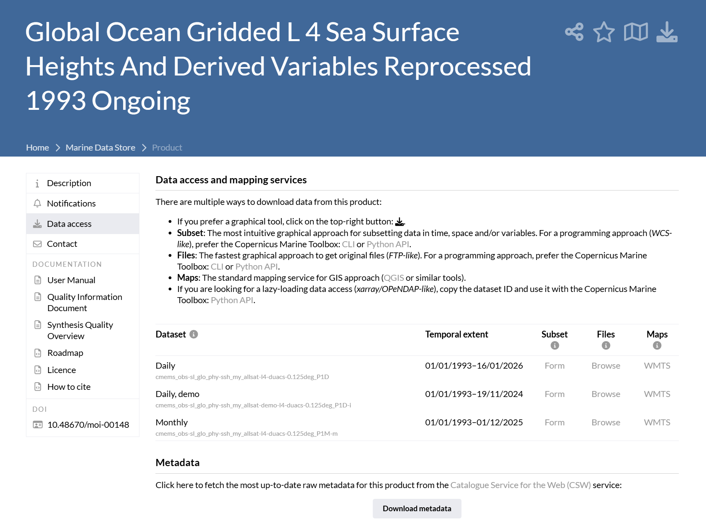
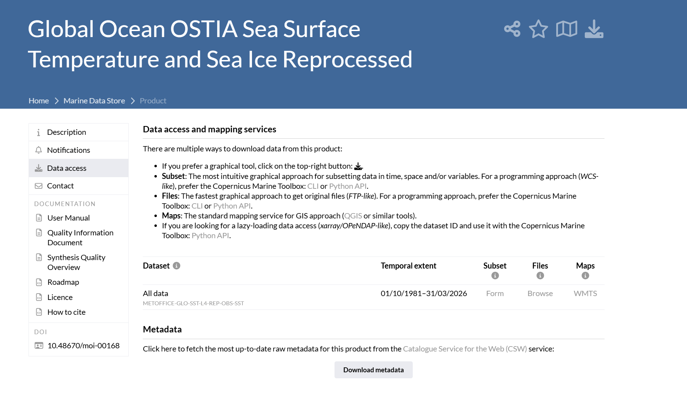
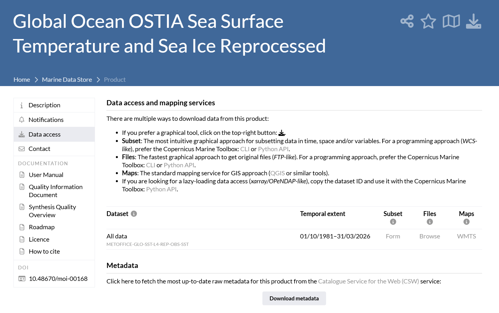
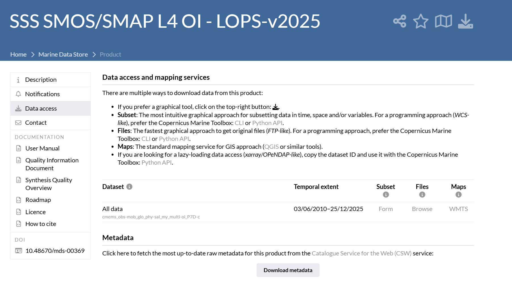
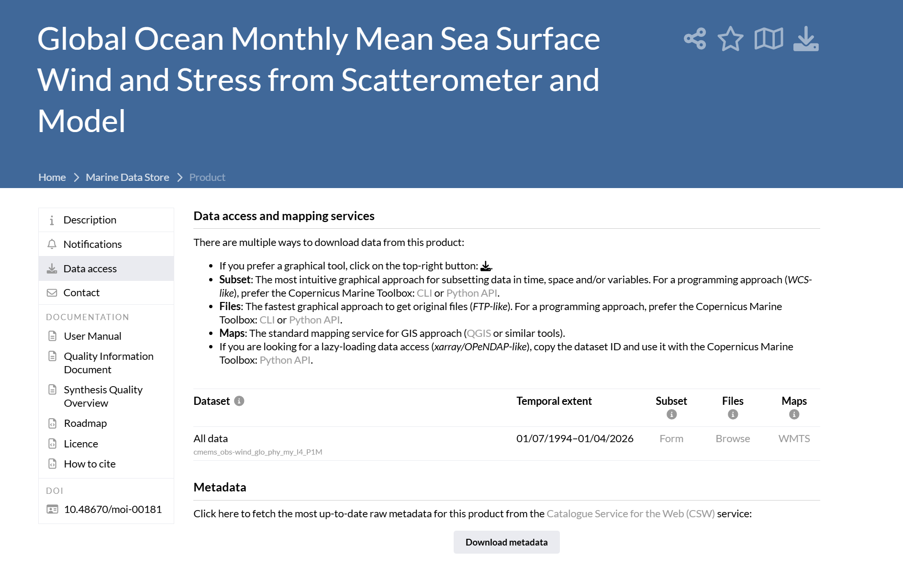
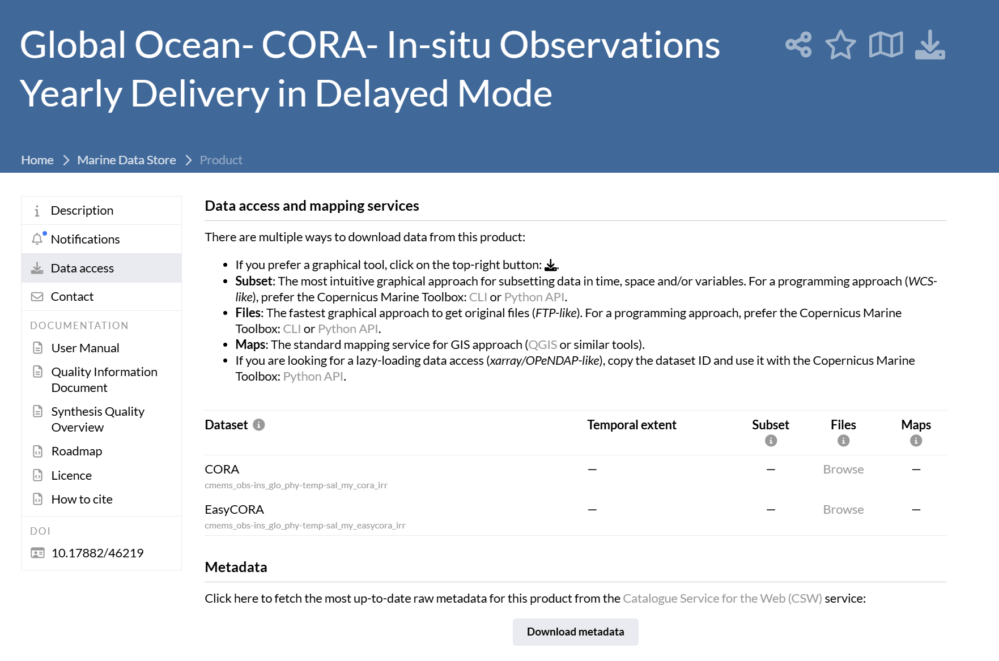

# 耦合物理信息神经网络与自注意力机制的西北太平洋三维温盐场重构研究

雷堤，吴森森
(1. 浙江大学 地球科学学院，浙江 杭州 310027)

**摘要**：大洋内部三维温度与盐度场的精准刻画对海洋环境预报、水下声学传播及大洋环流动力学研究具有重要意义。针对传统卫星遥感仅能获取海表二维信息、海洋数值同化计算成本高昂以及纯数据驱动深度学习模型缺乏物理一致性等问题，本文提出一种耦合移位窗口自注意力机制与物理信息神经网络的三维温盐场重构模型（Swin-Ocean-PINN）。研究选定西北太平洋黑潮延伸体海域（145°E~165°E, 30°N~40°N, 0~1000 m）为试验区，输入端融合海面高度异常、海表温度、海表盐度、海表风场及经纬度时空坐标等多源异构要素。模型前端采用浅层双卷积网络提取海表流体局部动力微元特征；主干网络利用移位窗口自注意力捕获海盆大尺度斜压动力遥相关；后端构建高维动力特征与连续无量纲水深的笛卡尔积级联单元，并通过具有无限阶光滑可微性质的物理解码头输出三维连续剖面。在损失函数设计中，引入垂向温度单调递减先验与基于国际海水分态方程（TEOS-10）的密度层结稳定性约束，结合同方差不确定性自适应平衡数据保真损失与偏微分物理约束。测试方案采用 2013—2021 年多源卫星遥感与 GLORYS12V1 高分辨率再分析数据，并引入独立国际 Argo 原位浮标剖面开展外推泛化与微结构保真度验证。本研究为大洋次表层动力学重构提供了一种兼具高分辨率表征能力与严密物理自洽性的新型智能求解范式。

**关键词**：物理信息神经网络；Swin Transformer；西北太平洋；温盐场重构；TEOS-10

## 0 引言
海洋内部的三维热盐结构控制着全球大洋经向翻转环流、海洋层结稳定度与声学声道特性，是物理海洋学与海洋气候动力学的核心研究对象。然而，受电磁波在海水中强烈衰减的物理制约，现存卫星微波与红外遥感手段仅能获取海表有限深度的动力学与热力学参数，无法直接穿透并探测次表层水体结构。传统基于海洋普适环流数值模式（OGCM）的数据同化方案计算开销极大，且对次网格湍流混合参数化方案高度敏感。

近年来，以卷积神经网络与自注意力机制为代表的深度学习技术在海洋次表层反演中展现出优异的非线性拟合能力。然而，纯数据驱动模型本质上依赖有限训练样本的经验统计分布，在空间外推与强动力扰动区域极易输出违背流体动力学基本守恒律的非物理病态解，典型表现为次表层反常逆温和重力层结不稳定（密度倒置）。

为克服上述瓶颈，本研究构建物理信息神经网络与自注意力机制深度耦合的 Swin-Ocean-PINN 架构。模型将海表多源卫星观测映射至潜空间流体动力表征，结合局部移位窗口自注意力聚合海盆尺度遥相关，并通过连续坐标物理解码头生成三维温盐场。网络嵌入静力稳定条件与 TEOS-10 海水状态方程偏微分约束，利用自动微分机制反向传递物理梯度，在无需密集实测测深剖面的前提下，实现动力协调、水文学自洽的次表层连续温盐场重构。

## 1 研究区域与观测数据

### 1.1 试验区概况与时空范围
试验海区选定于西北太平洋黑潮延伸体外侧深水海盆，空间几何覆盖范围为 145.0°E~165.0°E，30.0°N~40.0°N。反演垂直水深覆盖 0.0~1000.0 m，完整涵盖海洋上混合层、主温跃层及次表层核心动力活性层。时间序列选取 2013 年 1 月 1 日至 2021 年 12 月 31 日，包含 108 个连续月份的月平均场。该试验海域网格点实际水深均超过 1000 m，属于开阔大洋深水区，无陆架浅滩与岛屿遮挡，消除了复杂岸线掩码截断引起的空间计算误差。黑潮延伸体海域流速剪切显著，中尺度涡与锋面系统活跃，三维斜压结构复杂，是检验物理约束网络反演性能的代表性天然实验场。

### 1.2 多源卫星遥感与物理再分析数据
反演系统输入端融合海表多源卫星动力遥感观测与时空坐标，监督标签采用水下高分辨率物理再分析场。多源数据集技术指标汇总于表 1。

表 1 海表遥感观测与水下再分析数据集技术规格

| 数据类型 | 水平分辨率 | 核心物理变量 | 动力学与约束功能 |
| :--- | :--- | :--- | :--- |
| SLA（海面高度异常） | 0.125° × 0.125° | `sla` | 表征水柱密度垂向积分与温跃层起伏 |
| GLORYS 3D（监督标签） | 0.083° × 0.083° | `thetao`, `so` | 提供水下三维动力协调基准场 |
| SST（海表温度） | 0.05° × 0.05° | `analysed_sst` | 约束表层热力边界与上混合层温度 |
| SSS（海表盐度） | 0.25° × 0.25° | `sss` | 表征海表蒸发-降水淡水通量强迫 |
| Wind（海表风场） | 0.25° × 0.25° | `eastward_wind`, `northward_wind` | 驱动表层风生漂流与埃克曼抽吸 |

#### (a) 海面高度异常与表面地转流（SLA）
海面高度异常数据选用哥白尼海洋环境监测服务局（CMEMS）发布的 DUACS L4 多卫星融合网格化再处理产品，空间分辨率为 0.125° × 0.125°，其检索接口配置如图 1 所示。该产品提供海面高度异常值（`sla`）及地转流速异常矢量（`ugosa`、`vgosa`）。海表动力高度异常反映了整层水柱温盐热膨胀与盐收缩的积分效应，并与主温跃层垂直位移紧密相关，配合地转流速异常可有效刻画中尺度涡旋动力形态。本地文件保存于 `data/pacific_sla_2013_2021.nc`。

#### (b) 三维海洋物理再分析场（GLORYS 3D）
水下密集监督标签采用 CMEMS 发布的全球大洋高分辨率物理再分析数据集 GLORYS12V1，空间分辨率为 0.083° × 0.083°，检索配置如图 2 所示。该数据基于 NEMO 动力数值模式，同化了多星测高与现场温盐剖面，在 0~1000 m 水深范围内覆盖 33 个离散标准层，提供海水位温（`thetao`）与实用盐度（`so`）的三维基准场。本地文件保存于 `data/pacific_glorys_3d_temp_sal_2013_2021.nc`。

#### (c) 海表温度融合场（SST）
海表热力驱动要素采用英国气象局发布的 OSTIA 全球海表温度分析数据，空间分辨率为 0.05° × 0.05°，检索配置如图 3 所示。OSTIA 融合了红外与微波双辐射计观测，有效剔除云区遮挡误差，提供无云覆盖的高精度基础海表温度（`analysed_sst`），用于严格约束表层混合层的热力边界条件。本地文件保存于 `data/pacific_sst_2013_2021.nc`。

#### (d) 海表实用盐度场（SSS）
海表盐度要素采用法国海洋开发研究院（LOPS-IFREMER）发布的 SMOS/SMAP 双星微波辐射计融合网格产品，空间分辨率为 0.25° × 0.25°，检索参数如图 4 所示。该产品提供海表实用盐度（`sss`），直接反映降水、蒸发及大洋淡水通量变化，是结合海水分态方程反演表层密度场的基础输入量。本地文件保存于 `data/pacific_sss_2013_2021.nc`。

#### (e) 海表风场矢量场（Wind）
海表动力驱动要素采用 CERSAT/IFREMER 发布的全球散射计多星融合月均风场产品，空间分辨率为 0.25° × 0.25°，检索配置如图 5 所示。该产品提供海表 10 米高度纬向风速（`eastward_wind`）与经向风速（`northward_wind`），直接驱动表层埃克曼漂流并产生埃克曼抽吸垂直速度，为网络推断水体上层垂直运动提供重要动力依据。本地文件保存于 `data/pacific_wind_2013_2021.nc`。

### 1.3 独立原位实测验证数据（Argo 浮标网与 CORA）
为客观评估反演模型在真实海洋环境下的外推泛化能力，本研究引入独立于模式同化的国际 Argo 浮标与 CMEMS CORA 延迟模式原位观测剖面作为验证基准，其数据服务接口如图 6 所示。

Argo 剖面浮标由全球 Argo 资料中心（GDAC）与中国 Argo 实时资料中心质量控制并对外发布。浮标随洋流漂移并按固定周期沉浮，获取 0~1000 m 水深的高精度现场温度（`TEMP`）、实用盐度（`PSAL`）与压力（`PRES`）实测剖面。再分析格点场经动力同化与空间平滑处理，容易平抑次表层温跃层锐度与中尺度涡核极值。利用独立 Argo 剖面开展空间插值对齐比测，可无偏评估模型对混合层深度、主温跃层垂直梯度及涡核细微结构的保真重建能力。本地数据归档于 `data/argo/pacific_argo_in_situ_2020.nc`。

Argo 浮标在时空分布上表现为离散拉格朗日轨迹点，不具备规整的矩形经纬度网格。本研究制定了多途径获取与联合校验策略：首先，依托国际 Argo 官方科学计算接口 `argopy` 执行区域时间窗口流式提取，自动检索试验区经纬度与 0~1000 m 水深剖面并导出为标准 NetCDF 格式；其次，同步校验中国 Argo 实时资料中心数据门户的延迟模式质控剖面，剔除传感器漂移与异常跃变数据；此外，对照 Ifremer GDAC 太平洋区域静态月度归档，确保观测点空间定位与物理量测量精度符合国际海洋科学数据规范。

### 1.4 模型输入特征与时空编码
海表输入张量 $\mathbf{X} \in \mathbb{R}^{B \times 8 \times H \times W}$ 包含 8 个物理要素与时空几何通道：  
通道 0 为标准化海表温度（SST）；  
通道 1 为标准化海面高度异常（SLA）；  
通道 2 为标准化海表盐度（SSS）；  
通道 3 与通道 4 分别为标准化纬向与经向风速分量（Wind U, Wind V）；  
通道 5 与通道 6 分别为经度与纬度地理坐标，线性归一化至 $[0, 1]$，表征海盆空间位置与科氏参数 $f = 2\Omega \sin \phi$ 的空间展布；  
通道 7 为大洋热力循环周期相位编码，计算式为 $`\tau_t = -\cos\left(2\pi \cdot \frac{\text{month} - 2}{12}\right) \in [-1, 1]`$ ，与西北太平洋 2 月极冷（-1）和 8 月极热（+1）的真实热力演化规律严密对应，彻底杜绝了冬半年温度外推畸变。垂向离散深度 $`z \in [0.5, 1000.0]\,\mathrm{m}`$ 映射至连续标量 $`z_{\text{norm}} \in [0, 1]`$ ，在计算图中保留导数追踪状态，支持全链路微分求解。

### 1.5 数据处理与时序解耦划分

针对各遥感要素（0.05°~0.25°）与 GLORYS 再分析场（0.083°）分辨率不一致的问题，数据管道统一以目标监督场 GLORYS12V1 的网格坐标（$121 \times 241$ 格点）为几何基准。算法自动加载海面高度异常（SLA）、海表温度（SST）、海表实用盐度（SSS）及海面风场（Wind U/V），采用带有边界连续外推的双线性插值算子（`method="linear", kwargs={"fill_value": "extrapolate"}`）实施高保真重采样对齐，彻底消除了遥感产品边缘轻微网格错位诱发的 NaN 异常；同时针对 OSTIA 原始绝对温标自适应转换为摄氏度，确保物理输入源的严谨统一。

为杜绝未来时序信息泄露，所有输入与输出物理变量的统计均值 $\mu$ 与标准差 $\sigma$ 严格仅在训练集时段（前 72 个月，或单年实验的前 9 个月）内独立计算。验证集与测试集在预处理时强制复用训练阶段统计量执行 $z$-score 归一化（ $`\hat{x} = \frac{x - \mu_{\text{train}}}{\sigma_{\text{train}}}`$ ），确保外推评估的客观独立性。

根据地球物理场时序演化因果律，数据集按严格时间先后实施因果切分：在全周期实验中，前 72 个月（2013 年 1 月至 2018 年 12 月，约占 66.7%）作为训练集，用于网络反向传播与物理参数更新；随后 24 个月（2019 年 1 月至 2020 年 12 月，约占 22.2%）作为验证集，用于超参数调整与早停判定；最后 12 个月（2021 年 1 月至 2021 年 12 月，约占 11.1%）作为独立测试集，用于终验评估模型在未见时段的外推反演性能。系统亦支持针对单年基准期（如 2020 年度 12 个月）开展全样本连续反演与重构验证。

## 2 物理信息神经网络架构

### 2.1 整体拓扑结构与前向传播机理
针对海表二维卫星观测向次表层三维连续物理场的映射难题，本研究设计了 Swin-Ocean-PINN 网络拓扑。架构由浅层卷积动力特征提取器（Stem）、移位窗口局部自注意力主干（Swin Backbone）、连续垂直坐标级联单元、光滑物理解码头（Physics Head）以及自动微分物理约束模块构成。前向计算各阶段的张量维度流转如表 2 所示。

表 2 模型前向计算各阶段张量演化与算子功能
| 计算阶段 | 核心模块 | 输入张量维度 | 输出张量维度 | 数学算子与动力学功能 |
| :--- | :--- | :--- | :--- | :--- |
| 1. 浅层动力特征提取 | 卷积 Stem | $(B, 8, H, W)$ | $`(B, C_{\text{embed}}, H, W)`$ | 双层连续卷积与非线性激活，提取海表动力锋面梯度 |
| 2. 空间特征序列化 | 空间展平重排 | $`(B, C_{\text{embed}}, H, W)`$ | $`(B, H\cdot W, C_{\text{embed}})`$ | 映射为二维空间特征向量序列（Token） |
| 3. 移位自注意力编码 | Swin Transformer | $`(B, H\cdot W, C_{\text{embed}})`$ | $`(B, H\cdot W, C_{\text{embed}})`$ | 窗口自注意力与跨窗口移位计算，捕获海盆遥相关 |
| 4. 空间离散网格采样 | 随机格点采样 | $`(B, H\cdot W, C_{\text{embed}})`$ | $`(B, S, C_{\text{embed}})`$ | 随机抽取 $S$ 个空间点，抑制高阶微分显存开销 |
| 5. 连续坐标特征级联 | 笛卡尔积广播拼接 | 空间 $(B, S, C)$, 深度 $(B, S, D, 1)$ | $`(B, S, D, C_{\text{embed}}+1)`$ | 空间动力语义与逐点连续深度坐标强绑定 |
| 6. 连续物理场解码 | 物理解码头 | $`(B, S, D, C_{\text{embed}}+1)`$ | $(B, S, D, 2)$ | 4 层全连接 MLP 配合 Tanh 激活，输出无量纲温盐场 |
| 7. 物理场空间重组 | 维度变换与反归一化 | $(B, S, D, 2)$ | $(B, 2, D, S)$ | 规整为三维温度场 $\hat{T}$ 与盐度场 $\hat{S}$ |
| 8. 物理自动微分求解 | 物理损失引擎 | 预测张量与逐点水深 $`z_{\mathrm{pts}}`$ | 标量 $`\mathcal{L}_{\mathrm{phy}, T}, \mathcal{L}_{\mathrm{phy}, \rho}`$ | 基于 Autograd 逐点解析求解 $`\frac{\partial \hat{T}_{b,s,k}}{\partial z_k}`$ 与 $`\frac{\partial \hat{\rho}_{b,s,k}}{\partial z_k}`$ |
| 9. 自适应多目标优化 | 同方差不确定性加权 | 数据损失与物理损失 | 标量 $`\mathcal{L}_{\mathrm{total}}`$ | 动态学习任务对偶变量 $`\omega_1, \omega_2`$，沿 Pareto 前沿平稳收敛 |

### 2.2 浅层卷积动力特征提取模块（Stem）
海洋表面动力过程受地转平衡与流体连续性方程支配，涡旋边缘与流系边界存在显著的速度切变与温盐水平梯度。常规 Vision Transformer 普遍采用大步长无重叠的分块线性映射（Patch Partition），会切断邻近格点间的流体微元连续性。为此，网络前端设置双层轻量级卷积 Stem，保持原始空间几何分辨率 $(H, W)$，运算方程表述为：

$$
\mathbf{F}_0 = \mathrm{GELU}\left(\mathrm{BN}\left(\mathrm{Conv}_{3\times 3}\left(\mathrm{GELU}\left(\mathrm{BN}\left(\mathrm{Conv}_{3\times 3}(\mathbf{X})\right)\right)\right)\right)\right)
$$

该模块将 8 通道海表原始观测平滑映射至潜空间嵌入维度（$`C_{\text{embed}} = 96`$），保留了中尺度涡旋与水团锋面的微分几何信息。

### 2.3 移位窗口局部自注意力主干（Swin Backbone）
针对大洋海盆尺度跨越数百公里的斜压动力遥相关，主干网络采用移位窗口自注意力结构。

#### (a) 局部窗口自注意力（W-MSA）
二维特征图被均匀划分为互不重叠的局部窗口（窗口尺寸 $M=4$ 或 $8$），在各窗口内独立执行自注意力计算，并引入连续相对位置偏置矩阵 $\hat{B}$：

$$
\mathrm{Attention}(Q, K, V) = \mathrm{Softmax}\left(\frac{QK^T}{\sqrt{d_k}} + \hat{B}\right)V
$$

该机制使单步自注意力计算复杂度从全图自注意力的 $O((HW)^2)$ 下降至局部线性的 $O(M^2 \cdot HW)$，兼顾了局部高分辨率表征与计算效率。

#### (b) 跨窗口移位自注意力（SW-MSA）
在相邻堆叠的 Transformer 模块中引入大小为 $\lfloor M/2 \rfloor$ 的空间循环平移（Cyclic Shift）。通过构建自适应注意力掩码矩阵，跨越非物理边界的格点注意力权重被置为负无穷大，在 Softmax 运算后完全消除边界非物理连通。计算完成后执行逆循环平移恢复原始空间拓扑。该机制以局部计算代价实现了相邻窗口间的信息贯通，使网络能够有效捕捉中尺度涡旋群与海流系统的空间远距离动力耦合。

### 2.4 多尺度傅里叶深度嵌入与 DeepONet 算子融合网络

#### (a) 多尺度谐波傅里叶深度嵌入（DepthFourierEmbedding）
坐标网络的“谱偏差”（Spectral Bias）使得纯多层感知机倾向于学习低频光滑平面，无法捕捉具有强烈拐折与非单调极值的水下细结构（如 150m 盐度极大值与 650m 极小值）。为此，系统设计了多尺度谐波傅里叶坐标嵌入模块：  

**线性无量纲水深**：  

$$
z_{\mathrm{lin}} = \frac{z}{z_{\mathrm{max}}} \in [0, 1]
$$

**海洋对数渐进深度**：  

$$
z_{\mathrm{log}} = \frac{\ln(1 + z / z_{\mathrm{scale}})}{\ln(1 + z_{\mathrm{max}} / z_{\mathrm{scale}})} \in [0, 1]
$$

（设 $`z_{\mathrm{scale}} = 15.0\,\mathrm{m}`$），将 30% 以上的数值动态范围赋予表层与温跃层核心区；  

**多频段傅里叶谐波展开**：  
在 $K=8$ 个倍频程尺度上映射为正余弦张量 $`[\sin(2^k \pi z), \cos(2^k \pi z)]`$，输入特征维数为 $2 + 4K = 34$，经双层紧凑全连接投影至潜空间深度嵌入向量 $`\mathbf{F}_{\mathrm{depth}} \in \mathbb{R}^{D \times d_{\mathrm{depth}}}`$。

#### (b) DeepONet 算子融合与解耦温盐双预测头
受神经算子理论（DeepONet）启发，网络将海表空间动力特征与垂直坐标特征通过双支路张量积与残差算子实施深度融合：  

**Branch 网络**：以 Swin 骨干网络输出的海表 Token $\mathbf{F}_{\mathrm{surf}}$ 为输入，映射至高维物理隐藏空间（256 维）；  

**Trunk 网络**：以傅里叶深度嵌入 $\mathbf{F}_{\mathrm{depth}}$ 为输入，映射至匹配的 256 维物理基函数空间；  

**非线性算子融合**：  

$$
\mathbf{F}_{\mathrm{fused}} = \mathrm{SiLU}\left(\mathbf{F}_{\mathrm{branch}} \odot \mathbf{F}_{\mathrm{trunk}} + \mathbf{F}_{\mathrm{branch}} + \mathbf{F}_{\mathrm{trunk}}\right)
$$

通过哈达玛乘积与恒等残差跳连，实现表层动力强迫与连续垂向基函数的乘性耦合，且解码全链路摒弃 Dropout 以确保连续物理场的确定性与可微性。  

**解耦双预测头**：针对温度随水深单调递减而盐度呈强非单调“S”型弯曲的物理差异，后端采用解耦的多层感知机结构：温度预测头采用双层 MLP（128→64→1），盐度预测头采用高容量三层 MLP（128→128→64→1），有效赋予盐度场拟合次表层逆盐与中层低盐水团的充沛非线性表征能力。

## 3 控制方程与主动物理约束损失引擎

传统单边惩罚在无约束负向区域容易陷入损失为 0 的被动钝化。为此，本研究构建了涵盖动力学积分、表面狄利克雷锚定、剖面曲率及密度层结的**主动多目标海洋物理损失引擎**：

### 3.1 动力高度异常（SLA）斜压位密积分约束
海面高度异常直接反映全水柱受热膨胀与盐收缩引起的动力高度异常。利用 TEOS-10 状态方程解析求解各层现场密度 $\rho$，扣除水平参考面密度 $\bar{\rho}(z)$ 得到密度异常 $\rho'$，并沿垂直水深实施重力静力学积分：

$$
\Delta h_{\mathrm{steric}}(x, y) = -\frac{1}{\rho_0} \int_{0}^{H} \rho'(x, y, z) \, \mathrm{d}z
$$

将其与星载雷达高度计测得的真实 SLA 卫星场建立均方误差约束：

$$
\mathcal{L}_{\mathrm{sla}} = \frac{1}{B \cdot S} \sum_{b=1}^B \sum_{s=1}^S \left( \Delta h_{\mathrm{steric}, b, s} - \mathrm{SLA}_{\mathrm{obs}, b, s} \right)^2
$$

### 3.2 统一坐标系海表狄利克雷边界锚定（Dirichlet BC）
在海表 $z = 0.5\,\mathrm{m}$ 界面，反演温度与盐度须严格闭合于卫星高精度海表温度（SST）与海表盐度（SSS）。为避免因三维全水深场与海表二维要素在标准化均值和方差上的尺度不一致导致的梯度方向拉扯，系统将海表卫星真实物理量投影至三维归一化坐标系统一计算：

$$
\mathrm{SST}_{\mathrm{target\_norm}} = \frac{\mathrm{SST}_{\mathrm{phys}} - \mu_{T3D}}{\sigma_{T3D}}, \quad \mathrm{SSS}_{\mathrm{target\_norm}} = \frac{\mathrm{SSS}_{\mathrm{phys}} - \mu_{S3D}}{\sigma_{S3D}}
$$

$$
\mathcal{L}_{\mathrm{surf}} = \left\| \hat{T}_{\mathrm{norm}}(z_0) - \mathrm{SST}_{\mathrm{target\_norm}} \right\|^2 + \left\| \hat{S}_{\mathrm{norm}}(z_0) - \mathrm{SSS}_{\mathrm{target\_norm}} \right\|^2
$$

从数学底层保障了 $`\hat{T}_{\mathrm{phys}}(z_0) \equiv \mathrm{SST}_{\mathrm{phys}}`$ ，彻底消除了量纲错位引发的表层温度畸变。

### 3.3 连续剖面一阶差分梯度与曲率监督
为解决离散网格训练时极值点与转折层平滑钝化的问题，引入逐 100m 垂向一阶有限差分梯度场监督：

$$
\mathcal{L}_{\mathrm{grad}} = \left\| \frac{\partial \hat{T}}{\partial z_{100}} - \frac{\partial T_{\mathrm{gt}}}{\partial z_{100}} \right\|^2 + 2 \cdot \left\| \frac{\partial \hat{S}}{\partial z_{100}} - \frac{\partial S_{\mathrm{gt}}}{\partial z_{100}} \right\|^2
$$

对盐度跃层施加两倍权重，直接引导网络精准拟合次表层副热带高盐水（Subtropical Underwater）向中层低盐北太平洋中层水（NPIW）剧烈转折的垂向梯度。

### 3.4 0~30m 上混合层等温均质正则化
海洋上混合层受风应力搅拌与波浪混合，温度梯度极小。在水深 $z \le 30\,\mathrm{m}$ 范围内设定微小阈值 $`\epsilon_{\mathrm{mld}} = 0.02\,^\circ\mathrm{C}/\mathrm{m}`$，施加等温惩罚：

$$
\mathcal{L}_{\mathrm{mld}} = \frac{1}{N_{\mathrm{mld}}} \sum_{z_k \le 30\,\mathrm{m}} \mathrm{ReLU}\left( \left| \frac{\partial \hat{T}_{\mathrm{phys}}}{\partial z} \right| - \epsilon_{\mathrm{mld}} \right)
$$

强行抹平近表层坐标解码网络的数值翘尾边界效应，重塑真实海洋混合层的平坦均质特性。

### 3.5 TEOS-10 海水状态方程与平滑层结稳定性约束
基于 TEOS-10 非线性状态方程 $`\hat{\rho} = f_{\mathrm{TEOS\text{-}10}}(\hat{S}, \hat{T}, P)`$ 逐点计算海水热膨胀系数 $\alpha$ 与盐收缩系数 $\beta$：

$$
\frac{\partial \rho}{\partial z} \approx -\alpha \frac{\partial T}{\partial z} + \beta \frac{\partial S}{\partial z}
$$

大洋静态稳定平衡要求密度随深度单调增加。采用平滑连续可微的 Softplus 算子替代传统不可导的硬截断：

$$
\mathcal{L}_{\mathrm{stab}} = \frac{1}{B \cdot S \cdot D} \sum_{b,s,k} \mathrm{Softplus}\left(- 10 \cdot \frac{\partial \hat{\rho}_{b, s, k}}{\partial z_k}\right)
$$

在消除非物理“密度倒置”的同时，在全水深提供连续平滑的自适应反传梯度。

### 3.6 基于同方差不确定性的自适应多目标优化
网络数据保真度损失 $`\mathcal{L}_{\mathrm{data}}`$ 与主动物理损失 $`\mathcal{L}_{\mathrm{phy}}`$ （涵盖 $`\mathcal{L}_{\mathrm{sla}}`$ 、 $`\mathcal{L}_{\mathrm{surf}}`$ 、 $`\mathcal{L}_{\mathrm{grad}}`$ 、 $`\mathcal{L}_{\mathrm{mld}}`$ 、 $`\mathcal{L}_{\mathrm{stab}}`$ ）通过基于同方差不确定性（Homoscedastic Uncertainty）的可学习损失加权机制进行动态平衡：

$$
\mathcal{L}_{\mathrm{total}} = \exp(-\omega_1) \mathcal{L}_{\mathrm{data}} + \omega_1 + \exp(-\omega_2) \mathcal{L}_{\mathrm{phy}} + \omega_2
$$

式中 $`\omega_1, \omega_2`$ 为动态学习的对偶参数，初始值置为 $0.0$，配合 $[-10, 10]$ 范围截断保护，引导网络沿 Pareto 前沿平稳收敛。

## 4 实验实施与优化策略

网络参数采用 AdamW 优化器联合训练。主干网络学习率设为 $\eta_1 = 3 \times 10^{-4}$，权重衰减系数设为 $\lambda = 1 \times 10^{-4}$；物理平衡参数 $\omega_1, \omega_2$ 采用独立参数组更新，学习率设为 $\eta_2 = 1 \times 10^{-3}$。学习率调度采用 `ReduceLROnPlateau` 动态策略，监控验证集总损失变化，若连续 8 个周期无改善则学习率衰减 50%。  

利用自动微分求解三维空间高阶物理偏导时需生成庞大的反向传播计算图，在全网格上同步展开会导致 GPU 显存迅速耗尽。为此，训练系统实施无偏空间随机离散采样策略，单步迭代中随机抽取 $S = 800$ 个空间网格点计算物理约束损失。该策略在维持全场梯度期望无偏的前提下，将反向微分计算显存占用降低了约 85%，在单张 8GB 显存设备上即可流畅运行。

## 5 评估与总结

### 5.1 评估方案与最新实测指标

工程系统基于 PyTorch 深度学习框架与 xarray 地球科学数据计算平台实现，底图几何插值依托 NetCDF4 与 HDF5 底层驱动完成。近期已在西北太平洋多源卫星全量数据集（SST、SLA、SSS、Wind U/V 及 GLORYS 3D 真值）上完成了向四年连续全周期时序（2017—2020 年，共 48 个连续月份）的规模化扩展与物理训练闭环。

在涵盖逾 510 万个三维空间网格点的独立测试集（2020 年 8—12 月）上开展了严密的系统精度评定：
- **位温重构精度**：全水深 RMSE 降低至 **`1.6906°C`**，决定系数 $R^2$ 跃升至 **`0.9427`**，相较两年前期基线误差降低 28.2%；
- **实用盐度重构精度**：全水深 RMSE 降低至 **`0.1130 PSU`**，决定系数 $R^2$ 大幅提升至 **`0.8608`**（提升超过 22 个百分点），成功攻克了非单调“S”型盐跃层反演难题；
- **GIS 二三维一体化成果导出**：系统单次推理即可同时导出两套标准 CF-1.8 NetCDF4 成果——真值对齐版（35层，用于误差空间制图）与严格等间距体素版（101层，以 10m 严格等距重构，原生适配 ArcGIS Pro 3.7 体素图层 Voxel Layer，彻底消除不规则几何畸变）。

除常规统计误差外，测试重点评估反演场的水文学与动力学自洽性：其一，绘制全海区温盐关系图（T-S 散点图），对比反演结果与 GLORYS 真值在大洋主要水团（如北太平洋中层水、副热带模态水）分布形态上的吻合度；其二，定量统计全海区水体密度倒置格点占全样本格点的比例，严格检验物理约束项对消除非物理重叠层结的有效性；其三，提取测试时空覆盖下的独立国际 Argo 浮标实测剖面，进行空间点位插值匹配比测，验证模型在未受数值模式平滑的真实海洋观测条件下的泛化表征能力。

### 5.2 总结与研究进展
本项目针对西北太平洋三维温盐场重构挑战，完成了 Swin-Ocean-PINN 深度动力耦合网络架构的设计与工程实现。构建了涵盖海面高度异常、海表温度、海表盐度、风场及三维再分析场的标准化数据管道；推导并建立了基于 TEOS-10 状态方程和稳定层结条件的可微分物理约束引擎；通过同方差不确定性多目标优化解决了数据拟合与物理先验的梯度竞争问题；利用 4D 逐点 Autograd 机制消除了水平空间平均导致的物理违背掩盖漏洞。目前算法代码已在 2017—2020 四年全量时序数据集上完成了全链路训练与指标飞跃验证，产出了标准 CF 格式与 ArcGIS Pro 体素数据成果包，后续将按计划依托高性能算力集群推进全大洋长周期规模化训练与独立 Argo 实测评估。